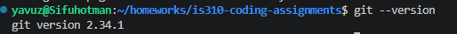
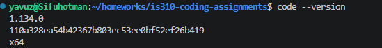

# Init IS310 Homework

## Proof of Installation

1. Python

2. Git

3. VS Code

4. Hypothesis Username

yavuza2

5. AI Tool/Workflow

I'm using Claude code as my main AI tool this semester. My workflow: I use it for debugging errors, explaining unfamiliar libraries or syntax, scaffolding code structure, and reviewing my work before submission. For anything AI-assisted, I log the prompts and outputs in ai-chat-log.md per the course policy. I write my own logic and reasoning first, then use AI to check my work, catch bugs, or speed up boilerplate rather than generate solutions from scratch.