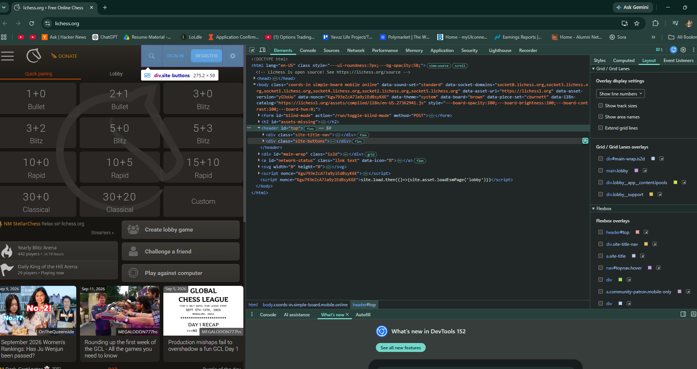
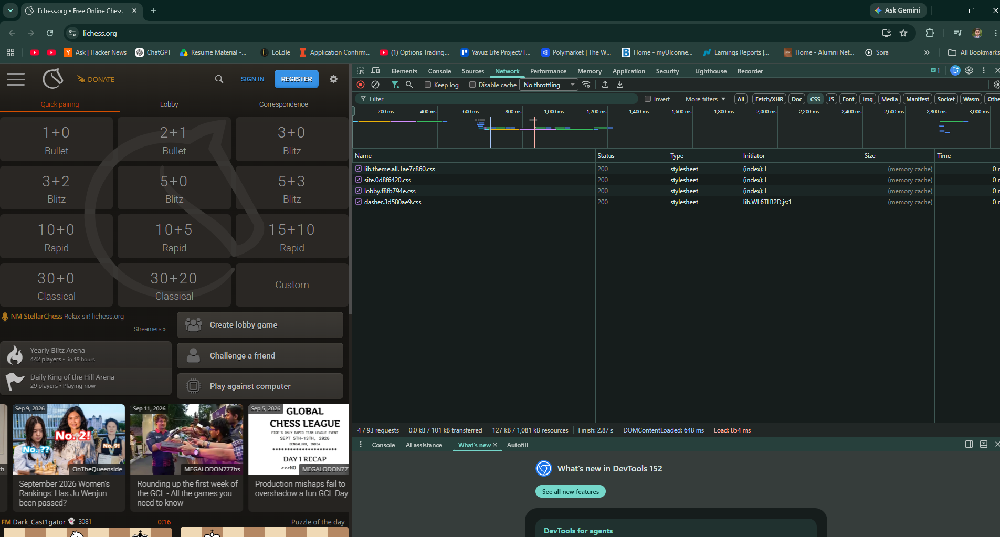
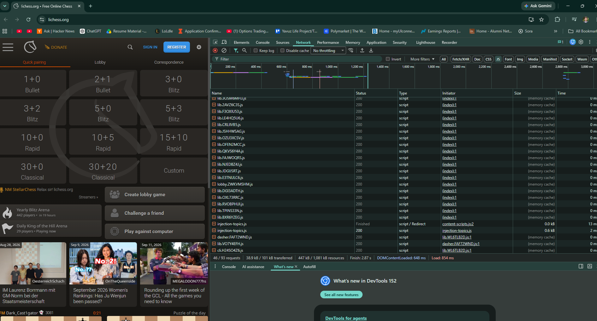
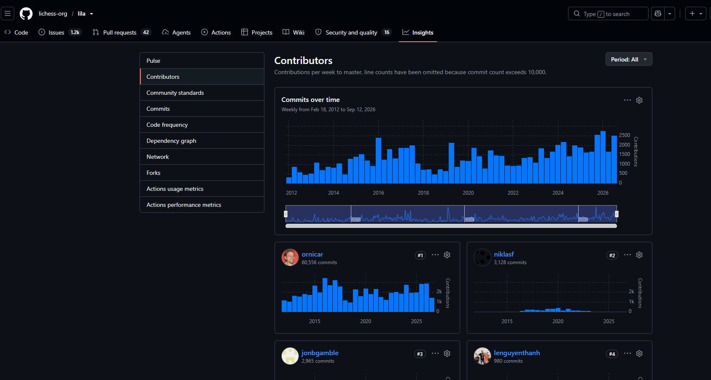

# Source and Style

Yavuz Abasiyanik

## Assignment 1: Inspecting the Cultural Web

**Site inspected:** [Lichess](https://lichess.org)
**Source repository:** [lichess-org/lila](https://github.com/lichess-org/lila)

### What web technologies were used?

When I opened the Elements tab I noticed the html and body tags have a bunch of
inline CSS variables on them, stuff like --board-opacity and --board-brightness,
so it looks like the site sets your display settings using CSS variables instead
of just hardcoding them. There's also this data-socket-domains attribute that
lists like 6 different socket subdomains, so I'm guessing that's for handling
real-time games (websockets) and they spread it across multiple servers. The
assets (images etc.) are also loaded from a totally different domain, lichess1.org,
and every script tag has a nonce on it which I looked up and it's a security thing
(Content Security Policy).

In the Network tab I counted 4 CSS files but 43 JS files, so this is definitely a
JS-heavy site, not just a static page. All the filenames have random hashes in
them like site.0d8f6420.css and lib.3OSM6MH3.js, which means these aren't named
by hand, they're probably auto-generated by whatever build tool they use.

### Files I did not recognize

There was one file called injection-topics.js that I didn't recognize, and when
I checked its initiator it said content-scripts.js. Turns out that's not even
part of the Lichess site, it's actually a browser extension I have installed
injecting itself into the page.

### Who built this website?

I checked the Contributors page on GitHub and set it to all-time, and it's
pretty lopsided. One person, ornicar, has 60,556 commits since 2012. The next
person, niklasf, only has 3,128. So ornicar has done like 19x more commits than
whoever is in second place. Kind of crazy that a site this big and popular is
basically maintained by one guy with some help.

### Why this site matters for my project

My semester project focuses on chess as cultural data. Lichess is both a cultural
platform and a data source: its open game database is one of the datasets I am
considering auditing. Inspecting how the site is built is a first step toward
understanding what it records about a game and what it leaves out.

## Assignment 2: Styling the Cultural Web

See `index.html` in this folder. The object is a walrus ivory king from the Lewis
Chessmen, held by the British Museum (museum number 1831,1101.83).